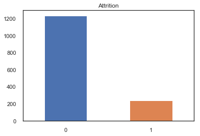
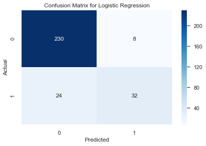
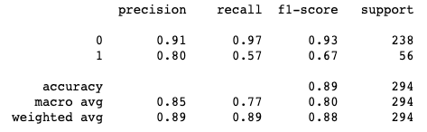

# Predicting Job Attrition

## Dataset

This is a fictional dataset created by IBM data scientists, hosted on Kaggle ([link](https://www.kaggle.com/pavansubhasht/ibm-hr-analytics-attrition-dataset)).

## Target

We are classifying on the 'Attrition' feature to predict whether or not an employee will leave or not. Due to a class imbalance of the feature, we will use SMOTE (Synthetic Minority Oversampling Technique) that helps place more weight on the minority class by generating sythetic data points.

## Modeling
We trained a couple models including:
    *Decision Tree
    *Random Forest
    *Logistic Regression
    *XGBoost
    *Support Vector Machine

### Scores
Our logistic regression model ended up being our best model, even compared to our tuned forest models. Our model predicts with an 89% accuracy score and 67% F-1 score.

